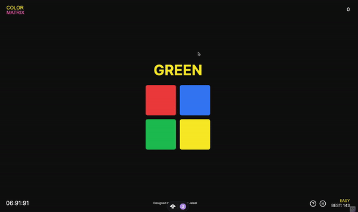

# Color Matrix Game

[](https://colormatrix.vercel.app/)

**Color Matrix** is a progressive web application (PWA) built with Next.js, designed to challenge and enhance cognitive abilities through the Stroop effect. This interactive game tests players' reaction times by asking them to identify the color of words, which may not match the meaning of the words themselves. It offers a fun and engaging way to experience a well-known psychological phenomenon while improving attention, cognitive flexibility, and processing speed.

## Features

- **Stroop Effect Gameplay**: Experience the cognitive challenge where the name of a color (e.g., "Blue") is printed in a color not denoted by the name (e.g., the word "Blue" printed in red).
- **Progressive Difficulty Levels**: From easy to insane, each level increases in difficulty by reducing the time allowed to respond and increasing the number of color options.
- **High Scores Tracking**: Keep track of your high scores for each difficulty level, encouraging you to improve.
- **Offline Capable**: Play without an internet connection once the app is installed on your device.

## Background on the Stroop Effect

The Stroop effect demonstrates the brain's reaction time when the color of a word's font and the word itself do not match. This interference in reaction times during a task is used within the game to create challenging levels that help train and measure cognitive agility and flexibility.

## Getting Started

### Installation

1. **Clone the repository:**

   ```bash
   git clone https://github.com/your-username/color-matrix.git
   cd color-matrix
   ```

2. **Install the dependencies:**

   ```bash
   pnpm install
   ```

3. **Run the development server:**
   ```bash
   pnpm run dev
   ```
   Open [http://localhost:3000](http://localhost:3000) to view it in the browser. The app will automatically reload if you make edits.

### Contributing

- Fork the repository
- Create a branch
  ```bash
  git checkout -b fix/amazingFix
  ```
- Commit your changes and push to your branch
  ```bash
  git commit -m "made an amazingFix"
  git push origin fix/amazingFix
  ```
- Open a pull request

## License

Distributed under the MIT License. See `LICENSE` for more information.
